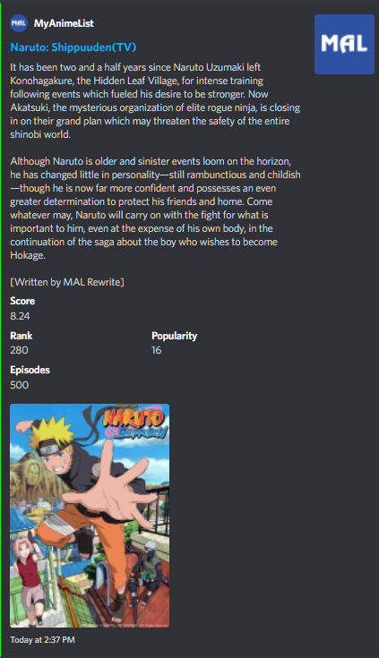

# mal-discord-info-bot

Discord bot that uses MyAnimeList API with such commands:

1. /title "anime title" - gets anime by title.

To make the bot work you should add your bot discord token and MAL client id to `src/main/resources/credentials.properties`.
# DO NOT PUSH credentials.properties !

### Example of output:

